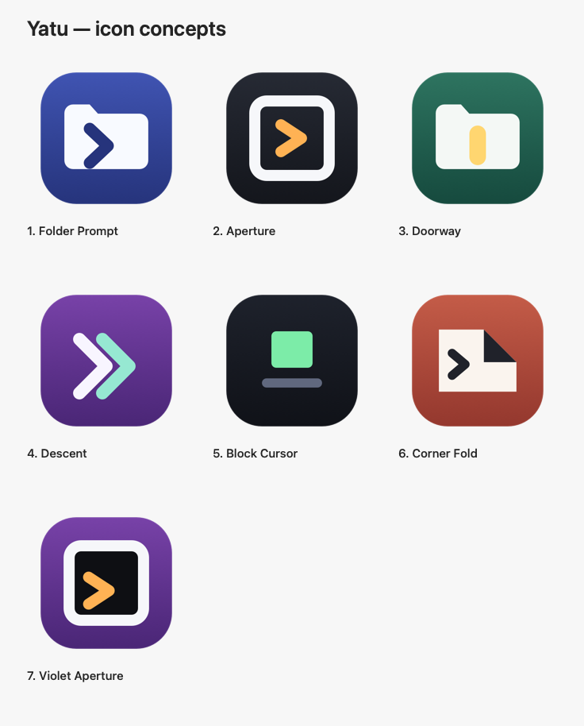
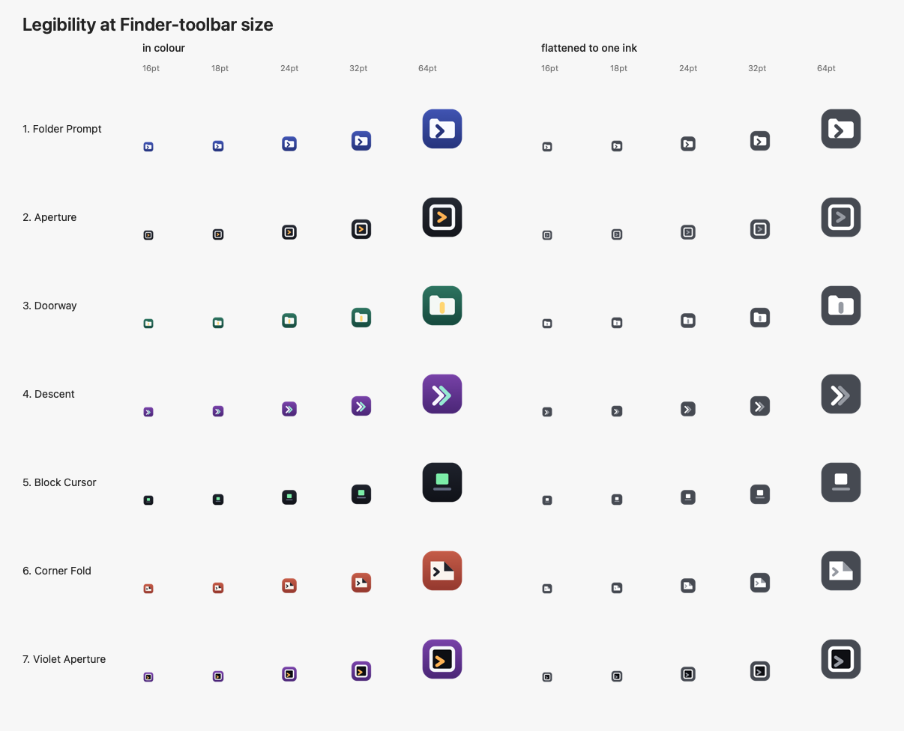

# Yatu icon concepts

A concept round. Nothing here is wired into the app: `Resources/AppIcon.icns` is still the
placeholder `bin/make-icon.swift` draws, and `bin/build.sh` keeps using it until a concept is
chosen. Decision belongs to plan §8.6.

Regenerate with `docs/icon-concepts/make-concepts.swift` (or `just icon-concepts`).

## These are source art, not exploration renders

Belvedere's board was ten image-model renders, and its README noted that a chosen concept would
have to be **redrawn as controlled source art** before shipping. These are drawn from geometry in
`make-concepts.swift`, so that step is already done: pick a number and the same code path that
produced the board produces the `.icns`. The trade is range — geometry gives flat, constructed
marks, not painted ones. If you want a richer visual direction first, `PROMPTS.md` has the six
directions written as image-model prompts to explore elsewhere; whatever comes back still has to
be rebuilt as geometry to ship.

## What the icon has to survive

This is the constraint that shaped every concept, and the reason for the second board:

1. **The Finder toolbar button, around 16–24pt.** This is where the app is actually used, and it
   is brutal. Most marks stop being marks below 24pt.
2. **The Dock and Finder at 128–512pt**, where it is a normal macOS app icon.
3. **Being distinct from what it launches.** Terminal.app, iTerm, Ghostty and Warp all own dark
   rounded squares. So does upstream.

## What we are moving away from

Upstream's OpenInTerminal-Lite toolbar icon is a thin grey outlined rectangle containing `>` and
`_`. The current Yatu placeholder is a chevron and an underscore on a dark rounded square — the
same idea in different clothes. Shipping that would make Yatu look like an unbranded rebuild of
upstream, which is precisely what it is not.

Also avoided, as too close to neighbours: a dark window with a prompt (Terminal.app, iTerm2), a
single large `>` (Warp), a monochrome glyph-in-a-circle (Ghostty).

## The six

| # | Name | Idea | Holds at 16pt? |
|---|---|---|---|
| 1 | **Folder Prompt** | The folder tab is bitten into a caret — one silhouette says both words | Partly; clear from 24pt |
| 2 | **Aperture** | A square opening with a caret inside; reads as a button, which is what it is | **No** — collapses to a ring |
| 3 | **Doorway** | A folder with a lit slot: the terminal as a way in, not a window | **Yes** |
| 4 | **Descent** | Two chevrons aimed into the corner — `cd`, with no folder drawn at all | **No** — smears |
| 5 | **Block Cursor** | One solid cursor on a baseline; the simplest thing that still says terminal | **Yes**, best of the six |
| 6 | **Corner Fold** | A folder with its corner turned back, dark terminal underneath | Fold survives, caret does not |
| 7 | **Violet Aperture** | 2's opening on 4's violet, inner field held black, caret set low and left | Better than 2 — the caret survives |

### Concept 7, requested 2026-09-18

A hybrid: concept 2's opening, concept 4's violet surround, the inner field held black rather than
inheriting the background, and the caret moved down and left to sit where concept 1's does instead
of centred in the opening.

It fixes 2's failure. The caret disappeared there because a mid-grey ring sat on a near-identical
dark field and the amber had nothing to separate from; against pure black inside a violet surround
it holds down to 18pt. The cost is layers — violet, white ring, black field, amber caret is four
materials in a 16px box, and at 16pt it resolves to a violet square with a light ring and an amber
speck. Compare it against 3 and 5 on the second board before settling.

The caret is still concept 2's amber. Descent's mint (`150, 232, 210`) is the other obvious choice
against that violet and would cost one line to try.

### Reading the second board

The small sizes are unsentimental. **5 (Block Cursor)** and **3 (Doorway)** are the only two that
are still themselves at 16pt, because both reduce to one solid shape against one field. **2** and
**4** fail: the aperture's caret disappears inside its own ring, and Descent's two chevrons fuse
into a smear. **1** and **6** are the strongest at Dock scale and the most generic at toolbar
scale — the usual trade.

The right-hand half flattens each concept to a single ink. It is not how macOS will draw them, but
it is a fast test of whether a mark depends on its colours to be read. **5** is unchanged by the
flattening; **1** and **2** lose the accent that carried their meaning.

## Recommendation

**3 (Doorway)**, with **5 (Block Cursor)** as the alternative.

Doorway is the only concept that survives the toolbar *and* says something specific: a folder you
are being let into, which is the whole product. Block Cursor reads better at 16pt than anything
else here, but "terminal" is all it says — it would suit a terminal emulator more than a thing
that opens one at a place.

If neither lands, the most promising unexplored direction is the inverse of 3: the folder as
negative space cut out of a solid field, which tends to hold at small sizes better than any drawn
mark. Say so and I will add it as concept 7.

## Not decided here

- **Yatu Edit** needs a sibling mark, not a recolour, if it ever ships (plan M6a).
- The chosen concept still needs a dark-mode check on a light Finder toolbar.
- No Icon Composer `.icon` bundle, ever: that is what broke rendering on macOS 26.6 (GH-283/287).
